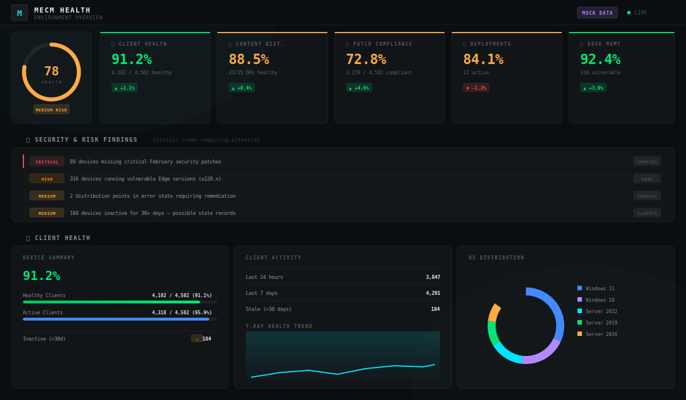

# MECM Environment Health Dashboard

A unified, cockpit-style web dashboard that consolidates data from **5 SCCM/MECM Power BI templates** into a single executive health overview.


---

<p align="center">
  
</p>

---

## Overview

Managing MECM/SCCM environments typically requires switching between multiple Power BI reports. This dashboard combines all five into **one real-time view**:

| Source Template | Dashboard Section |
|-----------------|-------------------|
| Client Status | Client Health - device activity, health trends, OS distribution |
| Content Status | Content Distribution - DP health, package status, failed distributions |
| Software Update Compliance | Patch Compliance - compliance %, missing updates by severity |
| Software Update Deployment | Deployments - active deployments with progress bars, error analysis |
| Microsoft Edge Management | Edge Management - version distribution, vulnerability tracking |

Plus: **Overall Health Score**, **Security & Risk Findings**, and **RAG status indicators** across all sections.

## Features

- **Cockpit-style dark theme** - JetBrains Mono font, neon glow effects, scanline overlay
- **Overall health ring** - combined score (0-100) with RAG color coding
- **Interactive score cards** - click to jump to any section
- **Real-time charts** - powered by Chart.js with gradient fills and glow effects
- **Security alerts banner** - prioritized findings with severity badges
- **Segmented deployment bars** - visual breakdown of installed/downloading/waiting/failed
- **Responsive layout** - works on desktop and tablet screens
- **Zero dependencies** - pure HTML/CSS/JS, no build step required

## Quick Start

### 1. Clone the repo

```bash
git clone https://github.com/shawnmbrooks85/MECM-Dashboard-HTML.git
cd MECM-Dashboard-HTML
```

### 2. Start the local server

```powershell
powershell -ExecutionPolicy Bypass -File serve.ps1
```

### 3. Open the dashboard

Navigate to **http://localhost:8090/** in your browser.

> The dashboard ships with **mock data** for immediate preview. See below for connecting to a real SCCM database.

## Connecting to Your SCCM Database

### Prerequisites

| Requirement | Details |
|-------------|---------|
| SQL Access | Read access to the ConfigMgr database |
| Auth | Windows Integrated Auth (default) or SQL credentials |
| Network | Machine running the script must reach the SQL Server |
| PowerShell | 5.1+ (built into Windows) |
| Database | Your site code database, e.g. `CM_PS1`, `CM_OPC` |

### Collect Data

```powershell
.\Collect-MECMData.ps1 -ServerName "YOUR-SQL-SERVER" -DatabaseName "CM_YOURSITECODE"
```

The script queries ~15 SCCM SQL views across all 5 domains and outputs `data/mock_data.json`.

### Examples

```powershell
# Windows auth (most common)
.\Collect-MECMData.ps1 -ServerName "mecmdb.corp.local" -DatabaseName "CM_PS1"

# Named SQL instance
.\Collect-MECMData.ps1 -ServerName "mecmdb\CONFIGMGR" -DatabaseName "CM_PS1"

# SQL authentication (prompts for credentials)
.\Collect-MECMData.ps1 -ServerName "mecmdb" -DatabaseName "CM_OPC" -UseCredential
```

### SQL Views Queried

| Domain | Views |
|--------|-------|
| Client Health | `v_CH_ClientSummary`, `v_Client`, `v_GS_COMPUTER_SYSTEM` |
| Content Distribution | `v_DistributionPoints`, `v_ContDistStatSummary`, `v_DistributionStatus` |
| Update Compliance | `v_UpdateComplianceStatus`, `v_UpdateInfo`, `v_UpdateScanStatus` |
| Deployments | `vSMS_SUMDeploymentStatusPerAsset`, `v_CIAssignment`, `v_Collection` |
| Edge Management | `v_GS_INSTALLED_SOFTWARE_CATEGORIZED` |

## Automating Data Refresh

```powershell
$action = New-ScheduledTaskAction `
    -Execute "powershell.exe" `
    -Argument "-ExecutionPolicy Bypass -File `"D:\MECM-Dashboard-HTML\Collect-MECMData.ps1`" -ServerName `"YOUR-SQL-SERVER`" -DatabaseName `"CM_YOURSITECODE`""

$trigger = New-ScheduledTaskTrigger -RepetitionInterval (New-TimeSpan -Hours 4) -At "6:00AM" -Daily

Register-ScheduledTask `
    -TaskName "MECM Dashboard Refresh" `
    -Action $action `
    -Trigger $trigger `
    -RunLevel Highest
```

## Project Structure

```
MECM-Dashboard-HTML/
  index.html              # Dashboard page
  styles.css              # Cockpit dark theme
  app.js                  # Rendering logic + Chart.js
  serve.ps1               # PowerShell HTTP server (port 8090)
  Collect-MECMData.ps1    # SCCM data collector script
  .gitignore
  data/
    mock_data.json         # Sample data (or real data after collection)
```

## Tech Stack

- **HTML5** - semantic markup
- **CSS3** - custom properties, glassmorphism, CSS animations
- **JavaScript** (ES6+) - vanilla, no frameworks
- **Chart.js 4.x** - via CDN
- **PowerShell** - data collection and local server

## License

MIT License - see [LICENSE](LICENSE) for details.
